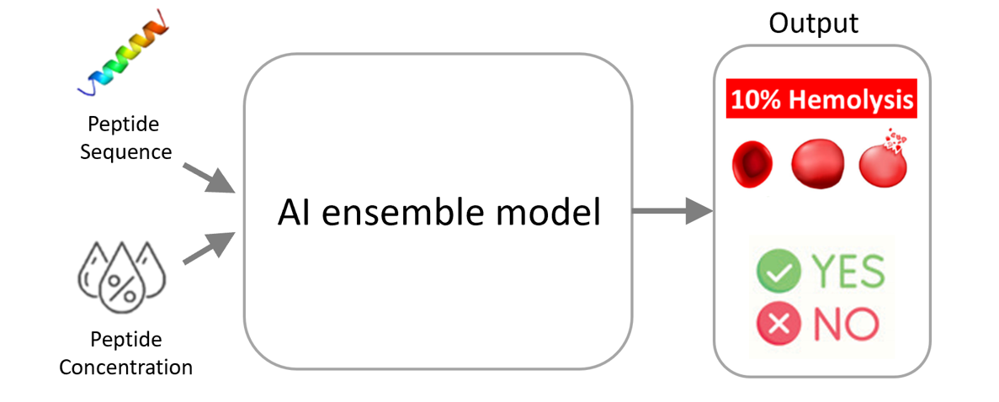
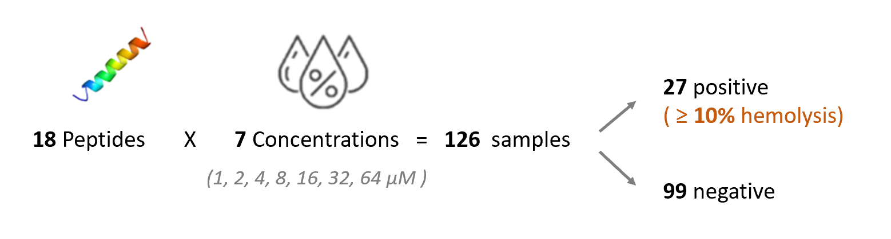
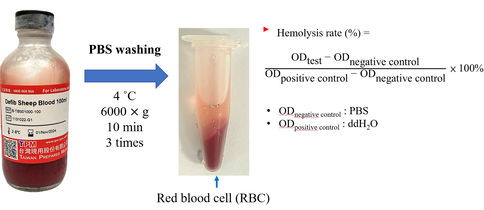
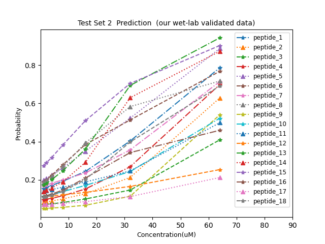

# Hemo_SnC
Stands for "Hemolysis Prediction of Therapeutic Peptides Based on Sequence and Concentration"

Poster Topic: Early Screening of Hemolytic Risk in Functional Peptides via Ensemble AI Using Sequence and Concentration Features

---

### Main Goal 
Therapeutic Peptides or Antimicrobial peptides (AMPs) with high hemolysis risk are unsuitable as drugs, but experimental validation is costly. Our model enables early in silico screening to filter out hemolytic candidates.

  

---

### Model Architecture

- model1 (PC6 encoding + CNN) 

  

- model2 (PepBERT encoding + MLP)

  

### Test Set Evaluation
We have 2 test sets, TestSet1 (10% dataset) and TestSet2 (our wet-lab validated data) 
Our TestSet2 is confidential and is not currently available on GitHub

TestSet2 comprises 18 peptides designed at 7 different concentrations and experimentally validated using sheep red blood cells.

  

  

- Concentration-dependent hemolysis risk profile 
The model predicted elevated hemolysis risk for the same peptides as concentration increased

  

