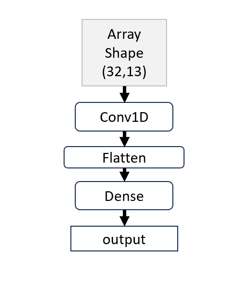
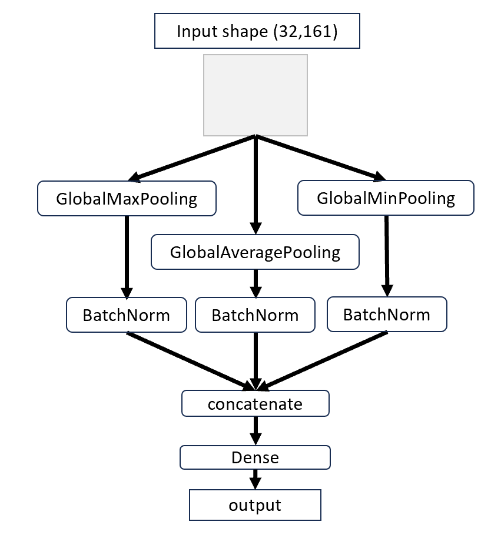
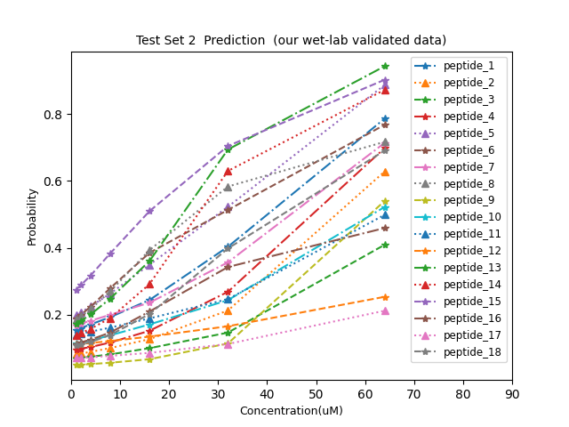

# Hemo_SnC
Brief intro: Hemolysis Prediction of Therapeutic Peptides Based on Sequence and Concentration

poster topic name: Early Screening of Hemolytic Risk in Functional Peptides via Ensemble AI Using Sequence and Concentration Features

---

### Main Goal 
Antimicrobial peptides (AMPs) with high hemolysis risk are unsuitable as drugs, but experimental validation is costly. Our model enables early in silico screening to filter out hemolytic candidates.

### Model Architecture

- model1 (PC6 encoding + CNN)

- model2 (PepBERT encoding + MLP)

### Test Set Evaluation
We have 2 test set, TestSet1 (10% dataset) and TestSet2 (our wet-lab validated data)
Our TestSet2 is confidential and is not currently available on GitHub

- Concentration-dependent hemolysis risk profile

TestSet2 is experimentally validated using sheep red blood cell

